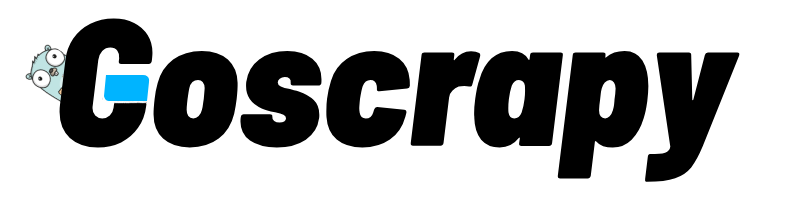

# GoScrapy: Web Scraping Framework in Go
 [](https://github.com/tech-engine/goscrapy)
<p align="center">
  
</p>

**GoScrapy** aims to be a powerful web scraping framework in Go, inspired by Python's Scrapy framework. It offers an easy-to-use Scrapy-like experience for extracting data from websites, making it an ideal tool for various data collection and analysis tasks, especially for those coming from Python and wanting to try scraping in Golang..

## Getting Started

Goscrapy requires **Go version 1.22** or higher to run.

### 1: Project Initialization

```sh
go mod init books_to_scrape
```

### 2. Install goscrapy cli

```sh
go install github.com/tech-engine/goscrapy@latest
```
**Note**: make sure to always keep your goscrapy cli updated.

### 3. Verify Installation

```sh
goscrapy -v
```
### 4. Create a New Project

```sh
goscrapy startproject books_to_scrape
```
This will create a new project directory with all the files necessary to begin working with **GoScrapy**.

```sh
\iyuioy\go\go-test-scrapy> goscrapy startproject books_to_scrape

🚀 GoScrapy generating project files. Please wait!

✔️  books_to_scrape\constants.go
✔️  books_to_scrape\errors.go
✔️  books_to_scrape\job.go
✔️  main.go
✔️  books_to_scrape\record.go
✔️  books_to_scrape\spider.go

✨ Congrates. books_to_scrape created successfully.
```

### spider.go
In your __`spider.go`__ file, set up and execute your spider.

For detailed code, please refer to the [sample code here](./_examples/scrapejsp_method2/scrapejsp/spider.go).

```go
package scrapejsp

import (
	"context"
	"encoding/json"
	"fmt"
	"log"

	"github.com/tech-engine/goscrapy/cmd/gos"
	"github.com/tech-engine/goscrapy/pkg/core"
)

type Spider struct {
	gos.ICoreSpider[*Record]
}

func NewSpider(ctx context.Context) (*Spider, <-chan error) {

	// use proxies
	// proxies := core.WithProxies("proxy_url1", "proxy_url2", ...)
	// core := gos.New[*Record]().WithClient(
	// 	gos.DefaultClient(proxies),
	// )

	core := gos.New[*Record]()

	// Add middlewares
	core.MiddlewareManager.Add(MIDDLEWARES...)
	// Add pipelines
	core.PipelineManager.Add(PIPELINES...)

	errCh := make(chan error)

	go func() {
		errCh <- core.Start(ctx)
	}()

	return &Spider{
		core,
	}, errCh
}

// This is the entrypoint to the spider
func (s *Spider) StartRequest(ctx context.Context, job *Job) {

	req := s.NewRequest()
	// req.Meta("JOB", job)
	req.Url("https://jsonplaceholder.typicode.com/todos/1")

	s.Request(req, s.parse)
}

func (s *Spider) Close(ctx context.Context) {
}

func (s *Spider) parse(ctx context.Context, resp core.IResponseReader) {
	fmt.Printf("status: %d", resp.StatusCode())

	var data Record
	err := json.Unmarshal(resp.Bytes(), &data)
	if err != nil {
		log.Fatalln(err)
	}

	// to push to pipelines
	s.Yield(&data)
}
```

<p align="center">
  
</p>

## Wiki
Please follow the [wiki](https://github.com/tech-engine/goscrapy/wiki) docs for details.

### Note

**GoScrapy** is not stable, so its API may change drastically. Please exercise caution when using it in production.

## License

**GoScrapy** is available under BSL with additional usage grant which allows for free internal use. Please make sure that you agree with the license before contributing to **GoScrapy** because by contributing to goscrapy project you are agreeing on the license.

## Roadmap

- ~~Cookie management~~
- ~~Builtin & Custom Middlewares support~~
- ~~Css & Xpath Selectors~~
- Logging
- Triggers
- Tests(work in progress)

## Partners

<a href="https://dashboard.mangoproxy.com/signup?promo=v7omc7">
	
</a>

## Get in touch
[Discord](https://discord.gg/FPvxETjYPH)
