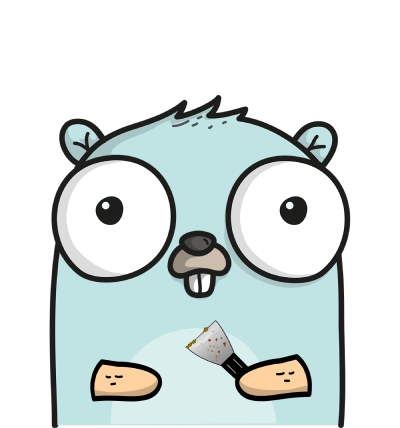

# GoScrapy: Web Scraping Framework in Go
 [](https://pkg.go.dev/github.com/tech-engine/goscrapy) [](https://github.com/tech-engine/goscrapy)
<p align="center">
  
</p>

**GoScrapy** aims to be a powerful web scraping framework in Go, inspired by Python's Scrapy framework. It offers an easy-to-use Scrapy-like experience for extracting data from websites, making it an ideal tool for various data collection and analysis tasks, especially for those coming from Python and wanting to try scraping in Golang..

## Getting Started
Follow these steps to start using **GoScrapy**:

### 1: Project Initialization
To initialize a project, open your terminal and run the following command:

```sh
go mod init <project_name>
```
Replace <project_name> with your desired project name. For example:

```sh
go mod init scrapejsp
```

### 2. Installation
After initialization, install the **GoScrapy** CLI Tool using this command:

```sh
go install github.com/tech-engine/goscrapy@latest
```
Note: You will only need to run the above command the very first time.

### 3. Verify Installation
To verify your installation, check your version **GoScrapy** version using the following command:

```sh
goscrapy -v
```
### 4. Create a New Project
Create a new **GoScrapy** project using the following command:

```sh
goscrapy startproject <project_name>
```
Replace <project_name> with your project name. For example:

```sh
goscrapy startproject scrapejsp
```
This command will create a new project directory with the all necessary files to begin working with **GoScrapy**.

```sh
PS D:\My-Projects\go\go-test-scrapy> goscrapy startproject scrapejsp

🚀 GoScrapy generating project files. Please wait!

✔️  scrapejsp\constants.go
✔️  scrapejsp\errors.go
✔️  scrapejsp\job.go
✔️  main.go
✔️  scrapejsp\output.go
✔️  scrapejsp\spider.go
✔️  scrapejsp\types.go

✨ Congrates. scrapejsp created successfully.
```

## Usage
### Defining a Scraping Task
**GoScrapy** operates around the below three concepts.

- **[Job](#job):** Describes an input to your spider.
- **[Output](#output):** Represents an output produced by your spider.
- **[Spider](#spider):** Contains the main logic of your scraper.


### Job
A Job represents an input to the goscrapy spider. In the provided code __`job.go`__, a Job struct is defined by fields like id and query of which only the id field is compulsory and you can add custom fields to the Job structure as you feel required.

```go
// id field is compulsory in a Job defination. You can add your custom to Job
type Job struct {
	id string
	query string // your custom field
}

// required
func (j *Job) Id() string {
	return j.id
}

// can add your custom receiver functions below, if you want to
// func (j *Job) SetQuery(query string) {
// 	j.query = query
// 	return
// }
```

### Output
An Output represents an output produced by your spider(via yield). It encapsulates the records obtained from scraping, any potential errors, and a reference to the associated Job. The Output struct, as defined in the __`output.go`__ code, contains methods to retrieve records, error information, and other details.

```go
// do not modify this file
type Output struct {
	records []Record
	err     error
	job     *Job
}
```

### Spider
A Spider encapsulate the main logic of your spider from the making a requests, parsing of responses, and data extraction.
<!-- Here goes the spider.go -->

## Example
This example illustrates how to utilize the **GoScrapy** framework to scrape data for the api https://jsonplaceholder.typicode.com. The example covers the following files:

- **[spider.go](#spidergo---spider-creation)**
- **[types.go](#typesgo---data-structure-definition)**
- **[main.go](#maingo---spider-execution)**

### spider.go
Define the spider responsible for handling the scraping logic in your __`spider.go`__ file. The following code snippet sets up the spider:

```go
package scrapejsp

import (
	"context"
	"errors"
	"net/url"

	"github.com/tech-engine/goscrapy/cmd/corespider"
	"github.com/tech-engine/goscrapy/pkg/core"
)

type Spider struct {
	corespider.ICoreSpider[[]Record]
	// you custom fields can go here
}

func NewSpider(core corespider.ICoreSpider[[]Record]) *Spider {
	return &Spider{
		core,
	}
}

// we will not go into the detail here
func (s *Spider) StartRequest(ctx context.Context, job *Job) {

	// for each request we must call NewRequest() and never reuse it
	req := s.NewRequest()

    // var headers http.Header

    // GET is the request method, method chaining possible
	req.Url("URL_HERE").
	Meta("MY_KEY1", "MY_VALUE").
	Meta("MY_KEY2", true)
	// Header(headers)
    
    /* POST
    req.Url(s.baseUrl.String())
    req.Method("POST")
	req.Header(headers)
    req.Body(<BODY_HERE>)
    */
    
    // call the next parse method
	s.Request(req, s.parse)
}

// can be called when spider is about to close
func (s *Spider) Close(ctx context.Context) {
}

func (s *Spider) parse(ctx context.Context, response core.IResponseReader) {
	// response.Body()
    // response.StatusCode()
    // response.Header()
	// response.Bytes()
	// response.Meta("MY_KEY1")
	
    // yielding output pushes output to be processed by pipelines, also check output.go for the fields
    // s.Yield(output)
}

```
The **NewSpider** function returns a new spider instance.

### types.go
In your __`types.go`__ file, define the **Record** structure that corresponds to the records you're scraping. Here's how the structure for the Record type looks like:

```go
/*
   json and csv struct field tags are required, if you want the Record to be exported
   or processed by builtin pipelines
*/

type Record struct {
	Id int `json:"id" csv:"id"`
	UserId int `json:"userId" csv:"userId"`
	Title string `json:"title" csv:"title"`
	Completed bool `json:"completed" csv:"completed"`
}
```


### main.go
In your __`main.go`__ file, set up and execute your spider using the **GoScrapy** framework by following these steps:

For implementation details, you can refer to the [sample code here](./_examples/scrapejsp/main.go).

## Pipelines 
In **GoScrapy** framework, pipelines play a pivotal role in managing, transforming, and fine-tuning the scraped data to meet your project's specific needs. Pipelines provide a powerful mechanism for executing a sequence of actions that are executed on the scraped data.

### Built-in Pipelines
**GoScrapy** as of now offers a few built-in pipelines you can choose from, designed to facilitate different aspects of data manipulation and organization.

- **Export2CSV**
- **Export2JSON**
- **Export2GSHEET**
- **Export2MONGODB**
- **Export2FIREBASE**

### Incorporating Pipelines into Your Scraping Workflow
To seamlessly integrate pipelines into your scraping workflow, you can utilize the **coreSpider.PipelineManager().Add()** method.

Here is an example on how you can add pipelines to your scraping process:

__`Export to JSON Pipeline`__:

```go
// goScrapy instance
goScrapy.PipelineManager().Add(
	pipelines.Export2CSV[[]Record](),
	pipelines.Export2JSON[[]Record](),
)

export2Json := pipelines.Export2JSON[[]Record]().WithFilename("test.json")

export2CSV := pipelines.Export2CSV[[]Record]().WithFilename("test.csv")

// we can also pass in your filename
goScrapy.PipelineManager().Add(
	export2CSV,
	export2Json,
)

// We can also create a pipelines group. All pipelines in a group runs concurrently.
// A group behaves like a single pipeline. Also pipelines in a group shouldn't be used
// for data transformation but for independent tasks like data export to a database etc.
pipelineGroup := pipelinemanager.NewGroup[[]scrapejsp.Record](
	//you can add pipelines you want to run concurrenly using pipeline groups
)
```

### Incorporating custom Pipelines
**GoScrapy** also allows you to define your own custom pipelines. To create a custom pipeline, you can use the command below.

**cd into your Goscrapy project directory**


```sh
PS D:\My-Projects\go\go-test-scrapy>scrapejsp> goscrapy pipeline export_2_DB

✔️  pipelines\export_2_DB.go

✨ Congrates, export_2_DB created successfully.
```

## Middlewares
**GoScrapy** also support inbuilt + custom middlewares for manipulation outgoing request.

### Built-in Middlewares
- **MultiCookiJar** 	- used for maintaining different cookie sessions while scraping.
- **DupeFilter** 		- filters duplicate requests

## Custom middleware
Implementing your custom middleware is fairly easy in **GoScrapy**. A custom middleware must implement the below interface.

```go
func MultiCookieJar(next http.RoundTripper) http.RoundTripper {
	return core.MiddlewareFunc(func(req *http.Request) (*http.Response, error) {
		// you middleware custom code here
	})
}
```

### Incorporating Middlewares into Your Scraping Workflow
To seamlessly integrate middlewares into your scraping workflow, you can utilize the **MiddlewareManager().Add()** method which is a variadic function and can accept arbirary number of middlewares.

Here is an example on how you can add middlewares to your scraping process:

__`MultiCookieJar Middleware`__:

```go
// goScrapy instance
goScrapy.MiddlewareManager().Add(
	middlewares.DupeFilter,
	middlewares.MultiCookieJar,
)
```

### Note

**GoScrapy** is not stable, so its API may change drastically. Please exercise caution when using it in production.

## License

**GoScrapy** is available under BSL with additional usage grant which allows for free internal use. Please make sure that you agree with the license before contributing to **GoScrapy** because by contributing to goscrapy project you are agreeing on the license.

## Roadmap

- ~~Cookie management~~
- ~~Builtin & Custom Middlewares support~~
- HTML parsing
- Triggers
- Unit Tests

## Contact
[Discord](https://discord.gg/FPvxETjYPH)
