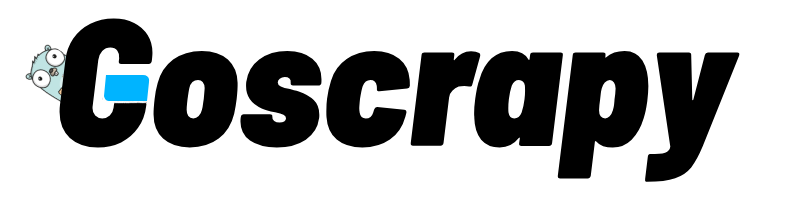

# GoScrapy: Web Scraping Framework in Go
 [](https://pkg.go.dev/github.com/tech-engine/goscrapy) [](https://github.com/tech-engine/goscrapy)
<p align="center">
  
</p>

**GoScrapy** aims to be a powerful web scraping framework in Go, inspired by Python's Scrapy framework. It offers an easy-to-use Scrapy-like experience for extracting data from websites, making it an ideal tool for various data collection and analysis tasks, especially for those coming from Python and wanting to try scraping in Golang..

## Getting Started
Follow these steps to start using **GoScrapy**:

### 1: Project Initialization
Initialize a project using:

```sh
go mod init scrapejsp
```

### 2. Installation
Install the **GoScrapy** CLI Tool:

```sh
go install github.com/tech-engine/goscrapy@latest
```
Note: You will only need to run the above command the very first time.

### 3. Verify Installation
Verify your installation:

```sh
goscrapy -v
```
### 4. Create a New Project
Create a new **GoScrapy** project:

```sh
goscrapy startproject scrapejsp
```
This will create a new project directory with the all necessary files to begin working with **GoScrapy**.

```sh
\iyuioy\go\go-test-scrapy> goscrapy startproject scrapejsp

🚀 GoScrapy generating project files. Please wait!

✔️  scrapejsp\constants.go
✔️  scrapejsp\errors.go
✔️  scrapejsp\job.go
✔️  main.go
✔️  scrapejsp\record.go
✔️  scrapejsp\spider.go

✨ Congrates. scrapejsp created successfully.
```

## Usage
### Defining a Scraping Task
**GoScrapy** operates around the below three concepts.

- **[Job](#job):** Describes an input to your spider.
- **[Record](#record):** Represents an output produced by your spider.
- **[Spider](#spider):** Contains the main logic of your scraper.


### Job
Job represents an input to the goscrapy spider. In __`job.go`__, a **Job** struct is defined by fields like id and query of which only the id field is compulsory and you can add custom fields to the Job structure as you feel required.

```go
// id field is compulsory in a Job defination. You can add your custom to Job
type Job struct {
	id string
	query string // your custom field
}

// required
func (j *Job) Id() string {
	return j.id
}

// can add your custom receiver functions below, if you want to
```

### Record
A Record represents an output produced by a spider(via yield).__`record.go`__ code, contains pointer receiver functions to retrieve record details.

```go
// Record must satisfy core.IOutput[*Record] interface

```

### Spider
Encapsulates the main logic of your spider from the making a requests, parsing of responses, and data extraction.
<!-- Here goes the spider.go -->

## Example
This example illustrates how to utilize the **GoScrapy** framework to scrape data for the api https://jsonplaceholder.typicode.com. The example covers the following files:

- **[spider.go](#spidergo---spider-creation)**
- **[record.go](#recordgo---data-structure-definition)**
- **[main.go](#maingo---spider-execution)**

### spider.go
We can define the spider in your __`spider.go`__ file as below:

```go
package scrapejsp

import (
	"context"
	"errors"
	"net/url"

	"github.com/tech-engine/goscrapy/cmd/gos"
	"github.com/tech-engine/goscrapy/pkg/core"
)

type Spider struct {
	gos.ICoreSpider[*Record]
	// you custom fields can go here
}

func NewSpider(core gos.ICoreSpider[*Record]) *Spider {
	return &Spider{
		core,
	}
}

// we will not go into the detail here
func (s *Spider) StartRequest(ctx context.Context, job *Job) {

	// for each request we must call NewRequest() and never reuse it
	req := s.NewRequest()

    // GET is the request method, method chaining possible
	req.Url("URL_HERE")
    
    // call the next parse method
	s.Request(req, s.parse)
}

// can be called when spider is about to close
func (s *Spider) Close(ctx context.Context) {
}

func (s *Spider) parse(ctx context.Context, response core.IResponseReader) {
	// Record as defined in record.go
	var data Record
	err := json.Unmarshal(resp.Bytes(), &data)

	if err != nil {
		log.Panicln(err)
	}

	// to push to pipelines
	s.Yield(&data)
}

```
**NewSpider** function returns a new spider instance.

### types.go
In your __`types.go`__ file, define the **Record** structure that corresponds to the records you're scraping. Here's how the structure for the Record type looks like:

```go
/*
   json and csv struct field tags are required, if you want the Record to be exported
   or processed by builtin pipelines
*/

type Record struct {
	J *Job `json:"-" csv:"-"` // required
	Id int 			`json:"id" csv:"id"` //optional
	UserId int 		`json:"userId" csv:"userId"` //optional
	Title string 	`json:"title" csv:"title"` //optional
	Completed bool 	`json:"completed" csv:"completed"` //optional
}
```


### main.go
In your __`main.go`__ file, set up and execute your spider using the **GoScrapy** framework by following these steps:

For detailed code, please refer to the [sample code here](./_examples/scrapejsp/main.go).

```go
package main

import (
	"context"
	"errors"
	"net/url"

	"github.com/tech-engine/goscrapy/cmd/gos"
	"github.com/tech-engine/goscrapy/pkg/core"
)

func main() {
	ctx, cancel := context.WithCancel(context.Background())

	var wg sync.WaitGroup
	wg.Add(1)
	// create a new gos(goscrapy) - uses the default in built http client
	gos := gos.New[*scrapejsp.Record]()

	// use you own client
	// gos := gos.New[*scrapejsp.Record]().WithClient(myOwnHttpClient)

	// cofigure the default client to use proxies
	// proxies := gos.WithProxies("proxy_url_1", "proxy_url_2", ...)
	// gos := gos.New[*scrapejsp.Record]().WithClient(gos.DefaultClient(proxies))

	// use middlewares
	// use pipelines
	
	// need to start it a separate go routine
	go func() {
		defer wg.Done()

		err := gos.Start(ctx)

		if err != nil && errors.Is(err, context.Canceled) {
			return
		}

		fmt.Printf("failed: %q", err)
	}()

	spider := scrapejsp.NewSpider(gos)

	// start the scraper with a job, currently nil is passed but you can pass your job here
	spider.StartRequest(ctx, nil)

	OnTerminate(func() {
		fmt.Println("exit signal received: shutting down gracefully")
		cancel()
		wg.Wait()
	})
}
```

## Pipelines 
Pipelines help in managing, transforming, and fine-tuning the scraped data.

### Built-in Pipelines
Below are built-in pipelines you can choose from.

- **Export2CSV**
- **Export2JSON**
- **Export2GSHEET**
- **Export2MONGODB**
- **Export2FIREBASE**

### Use Pipelines
We can add any pipeline to our project using **coreSpider.PipelineManager.Add()** function.

Here is an example:

__`Export to JSON Pipeline`__:

```go
// use export 2 csv pipeline
export2Csv := pipelines.Export2CSV[*testspider.Record]()
export2Csv.WithFilename("itstimeitsnowornever.csv")

// use export 2 json pipeline
export2Json := pipelines.Export2JSON[*testspider.Record]()
export2Json.WithImmediate() // immediately flushes buffer upon processing each record
export2Json.WithFilename("itstimeitsnowornever.json")
// we can use piplines
gos.PipelineManager.Add(
	export2Csv,
	export2Json,
)

// We can also create a pipelines group. All pipelines in a group runs concurrently.
// A group behaves like a single pipeline. Also pipelines in a group shouldn't be used
// for data transformation but for independent tasks like data export to a database etc.
pipelineGroup := pipelinemanager.NewGroup[*Record](
	//you can add pipelines you want to run concurrenly using pipeline groups
)

gos.PipelineManager.Add(pipelineGroup)
```

### Use custom Pipelines
**GoScrapy** supports custom pipelines. To create one, you can use the command below.

**cd into your Goscrapy project directory**


```sh
PS D:\My-Projects\go\go-test-scrapy>scrapejsp> goscrapy pipeline export_2_DB

✔️  pipelines\export_2_DB.go

✨ Congrates, export_2_DB created successfully.
```

## Middlewares
**GoScrapy** also support inbuilt + custom middlewares for manipulation outgoing request.

### Built-in Middlewares
- **MultiCookiJar** 	- used for maintaining different cookie sessions while scraping.
- **DupeFilter** 		- filters duplicate requests

## Custom middleware
Implementing custom middleware is fairly easy in **GoScrapy**. A custom middleware must implement the below **http.RoundTripper** interface.

```go
func MultiCookieJar(next http.RoundTripper) http.RoundTripper {
	return core.MiddlewareFunc(func(req *http.Request) (*http.Response, error) {
		// you middleware custom code here
	})
}
```

### Use Middlewares
We can add any middleware to our project using **MiddlewareManager.Add()**.

Here is an example:

__`MultiCookieJar Middleware`__:

```go
// goScrapy instance
gos.MiddlewareManager.Add(
	middlewares.DupeFilter,
	middlewares.MultiCookieJar,
)
```

### Note

**GoScrapy** is not stable, so its API may change drastically. Please exercise caution when using it in production.

## License

**GoScrapy** is available under BSL with additional usage grant which allows for free internal use. Please make sure that you agree with the license before contributing to **GoScrapy** because by contributing to goscrapy project you are agreeing on the license.

## Roadmap

- ~~Cookie management~~
- ~~Builtin & Custom Middlewares support~~
- HTML parsing
- Triggers
- Unit Tests(work in progress)

## Contact
[Discord](https://discord.gg/FPvxETjYPH)
