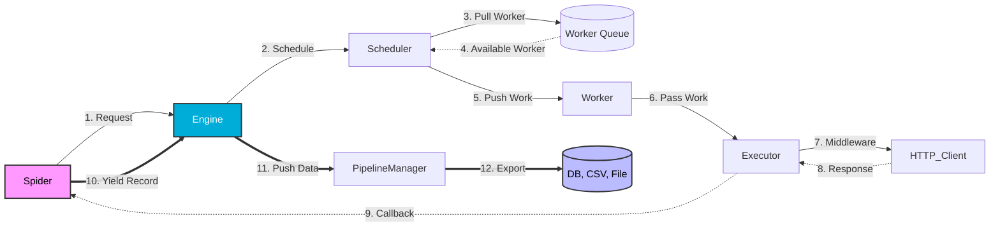

# GoScrapy: Web Scraping Framework in Go

<p align="center">
  
</p>

<p align="center">
  <a href="LICENSE"></a>
  <a href="https://go.dev/"></a>
  <a href="https://discord.gg/FPvxETjYPH"></a>
  <a href="https://goreportcard.com/badge/github.com/tech-engine/goscrapy"></a>
</p>

**GoScrapy** is a powerful web scraping framework in Go, inspired by Python's Scrapy framework. It offers an easy-to-use Scrapy-like experience for extracting data from websites, making it an ideal tool for various data collection and analysis tasks, especially for those coming from Python and wanting to try scraping in Golang.

## Why GoScrapy?

While callback-based scraping libraries are excellent tools and have incredibly valid use cases, a large portion of the web scraping community originates from the Python ecosystem. **GoScrapy** was built to provide these developers with a familiar, "home-like" experience by bringing the battle-tested, pipeline-driven architecture of Python's Scrapy natively to Go.

Instead of writing boilerplate code to handle retries, manage distinct cookie sessions, or export data to databases, GoScrapy offers a structured, plug-and-play framework. This allows you to focus entirely on your extraction logic while effortlessly relying on built-in pipelines and middlewares to do the heavy lifting concurrently.

## Features

- 🚀 **Blazing Fast** — Built on Go's concurrency model for high-throughput parallel scraping
- 🐍 **Scrapy-inspired** — Familiar architecture for anyone coming from Python's Scrapy
- 🛠️ **CLI Scaffolding** — Generate project structure instantly with `goscrapy startproject`
- 🔁 **Smart Retry** — Automatic retries with exponential back-off on failures
- 🍪 **Cookie Management** — Maintains separate cookie sessions per scraping target
- 🔍 **CSS & XPath Selectors** — Flexible HTML parsing with chainable selectors
- 📦 **Built-in Pipelines** — Export scraped data to CSV, JSON, MongoDB, Google Sheets, and Firebase out of the box
- 🧩 **Built-in Middleware** — Plug in robust middlewares like Azure TLS and advanced Dupefilters
- 🔌 **Extensible by Design** — Almost every layer of the framework—pipelines, middlewares, HTTP client, and selectors—is built to be swapped or extended without touching the core

## Architecture

GoScrapy's data flow is designed for clarity and concurrent execution:


```mermaid
flowchart LR
    %% Request Flow
    Spider -->|1. Request| Engine
    Engine -->|2. Schedule| Scheduler
    Scheduler -->|3. Pull Worker| WorkerQueue[(Worker Queue)]
    WorkerQueue -.->|4. Available Worker| Scheduler
    Scheduler -->|5. Push Work| Worker
    Worker -->|6. Pass Work| Executor
    Executor -->|7. Middleware| HTTP_Client

    %% Response Flow
    HTTP_Client -.->|8. Response| Executor
    Executor -.->|9. Callback| Spider

    %% Data Flow
    Spider ==>|10. Yield Record| Engine
    Engine ==>|11. Push Data| PipelineManager
    PipelineManager ==>|12. Export| Pipelines[(DB, CSV, File)]

    style Engine fill:#00ADD8,stroke:#333,stroke-width:2px,color:#fff
    style Spider fill:#f9f,stroke:#333,stroke-width:2px,color:#000
    style Pipelines fill:#bbf,stroke:#333,stroke-width:2px,color:#000
```

## Getting Started

Goscrapy requires **Go version 1.22** or higher to run.

### 1. Project Initialization

```sh
go mod init books_to_scrape
```

### 2. Install GoScrapy CLI

```sh
go install github.com/tech-engine/goscrapy@latest
```
> **Note**: make sure to always keep your goscrapy cli updated.

### 3. Verify Installation

```sh
goscrapy -v
```

### 4. Create a New Project

```sh
goscrapy startproject books_to_scrape
```
This will create a new project directory with all the files necessary to begin working with **GoScrapy**.

```sh
\iyuioy\go\go-test-scrapy> goscrapy startproject books_to_scrape

🚀 GoScrapy generating project files. Please wait!

✔️  books_to_scrape\constants.go
✔️  books_to_scrape\errors.go
✔️  books_to_scrape\job.go
✔️  main.go
✔️  books_to_scrape\record.go
✔️  books_to_scrape\spider.go

✨ Congrats, books_to_scrape created successfully.
```

## Quick Look: Powerful Features

GoScrapy minimizes boilerplate by letting you cleanly configure pipelines and middlewares in a dedicated `settings.go` file.

### settings.go
```go
package myspider

import (
	"time"

	pm "github.com/tech-engine/goscrapy/pkg/pipeline_manager"
	"github.com/tech-engine/goscrapy/pkg/middlewaremanager"
	"github.com/tech-engine/goscrapy/pkg/builtin/middlewares"
	"github.com/tech-engine/goscrapy/pkg/builtin/pipelines"
)

// Add Azure TLS client and Retry functionality seamlessly
var MIDDLEWARES = []middlewaremanager.Middleware{
	middlewares.AzureTLS(azureTLSOpts),
	middlewares.Retry(), // 3 retries, 5s back-off
}

// Prepare CSV export pipeline
var export2CSV = pipelines.Export2CSV[*Record](pipelines.Export2CSVOpts{
	Filename: "itstimeitsnowornever.csv",
})

// Export to CSV instantly
var PIPELINES = []pm.IPipeline[*Record]{
	export2CSV,
}
```

## Creating a Spider

In your `spider.go` file, set up and execute your spider.
For detailed code, please refer to the [sample code here](./_examples/scrapejsp_method2/scrapejsp/spider.go).

```go
package scrapejsp

import (
	"context"
	"encoding/json"
	"fmt"
	"log"

	"github.com/tech-engine/goscrapy/cmd/gos"
	"github.com/tech-engine/goscrapy/pkg/core"
)

type Spider struct {
	gos.ICoreSpider[*Record]
}

func NewSpider(ctx context.Context) (*Spider, <-chan error) {
	core := gos.New[*Record]()

	// Add middlewares and pipelines
	core.MiddlewareManager.Add(MIDDLEWARES...)
	core.PipelineManager.Add(PIPELINES...)

	errCh := make(chan error)
	go func() {
		errCh <- core.Start(ctx)
	}()

	return &Spider{
		core,
	}, errCh
}

// StartRequest is the entrypoint to the spider
func (s *Spider) StartRequest(ctx context.Context, job *Job) {
	req := s.NewRequest()
	req.Url("https://jsonplaceholder.typicode.com/todos/1")
	s.Request(req, s.parse)
}

func (s *Spider) Close(ctx context.Context) {
}

func (s *Spider) parse(ctx context.Context, resp core.IResponseReader) {
	fmt.Printf("status: %d", resp.StatusCode())

	var data Record
	if err := json.Unmarshal(resp.Bytes(), &data); err != nil {
		log.Fatalln(err)
	}

	// Yield sends the data securely to your configured pipelines
	s.Yield(&data)
}
```

<p align="center">
  
</p>

## Wiki
Please follow the [official Wiki](https://github.com/tech-engine/goscrapy/wiki) docs for complete details on creating custom pipelines, middlewares, and using the robust selector engine.

## Status Note

**GoScrapy is currently in active v0.x development.** We are continually refining the Core API towards a stable v1.0 release. We welcome community use, feedback, and Pull Requests to help us shape the future of scraping in Go!

## License

**GoScrapy** is offered under the Business Source License (BSL). 

**What does this mean for developers?**  
We want you to build amazing things with GoScrapy! You are completely free to use this framework in production, build your own commercial SaaS products that rely on it, and scrape data for your business without paying any licensing fees. 

The BSL is simply in place to ensure the sustainability of the project. To protect the core framework, we ask that you respect a few common-sense boundaries: please avoid offering GoScrapy as a competitive, managed "Scraper-as-a-Service," repackaging the framework under a new name, or commercializing direct codebase ports into other languages (whether translated manually or via AI tooling) as your own work.

By contributing to the GoScrapy project, you agree to the terms of the license.

## Roadmap

- ~~Cookie management~~
- ~~Builtin & Custom Middlewares support~~
- ~~Css & Xpath Selectors~~
- Logging
- Increasing E2E test coverage

## Partners

<a href="https://dashboard.mangoproxy.com/signup?promo=v7omc7">
	
</a>

## Get in touch
[Join our Discord Community](https://discord.gg/FPvxETjYPH)
