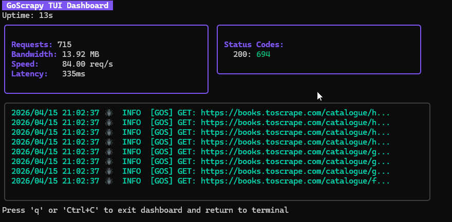
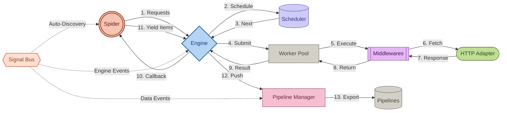

# GoScrapy: Web Scraping Framework in Go

<p align="center">
  
</p>

<p align="center">
  <a href="LICENSE"></a>
  <a href="https://go.dev/"></a>
  <a href="https://discord.gg/FPvxETjYPH"></a>
  <a href="https://goreportcard.com/badge/github.com/tech-engine/goscrapy"></a>
</p>

**GoScrapy** is a high-performance web scraping framework for Go, designed with the familiar architecture of Python's Scrapy. It provides a robust, developer-centric experience for building sophisticated data extraction systems, purposefully crafted for those making the leap from Python to the Go ecosystem.

## Why GoScrapy?

While low-level scraping libraries are powerful, many teams require the high-level architectural framework established by Scrapy. **GoScrapy** brings this architectural discipline natively to Go, organizing your request callbacks, middlewares, and pipelines into a structured, manageable workflow.

Instead of manually orchestrating retries, cookie isolation, or database handoffs, GoScrapy provides the engine that powers your spiders. You focus purely on the extraction logic; the framework manages the high-throughput lifecycle and concurrency in the background.

<p align="center">
  
</p>


## Features

- 🚀 **Blazing Fast** — Built on Go's concurrency model for high-throughput parallel scraping
- 🐍 **Scrapy-inspired** — Familiar architecture for anyone coming from Python's Scrapy
- 🛠️ **CLI Scaffolding** — Generate project structure instantly with `goscrapy startproject`
- 📡 **Signal-Driven** — Decoupled, event-driven architecture using a central signal bus
- 🧠 **Auto-Discovery** — Automatic detection of spider lifecycle methods (Open, Close, Idle)
- 🔁 **Smart Retry** — Automatic retries with exponential back-off on failures
- 🍪 **Cookie Management** — Maintains separate cookie sessions per scraping target
- 🔍 **CSS & XPath Selectors** — Flexible HTML parsing with chainable selectors
- 📦 **Built-in Pipelines** — Export to CSV, JSON, MongoDB, Google Sheets, and Firebase out of the box
- 🧩 **Built-in Middleware** — Plug in robust middlewares like Azure TLS and advanced Dupefilters
- 🎛️ **Telemetry & TUI** — Real-time terminal dashboard and global metrics monitoring
- 🔌 **Extensible** — Every layer (Scheduler, WorkerPool, Engine) is swappable and extensible
## Examples

For practical examples and real-world use cases, check the [_examples](./_examples) directory:

- [Google Maps Scraper](./_examples/google_maps_scraper) — Complete scraper for businesses on Google Maps.
- [Books to Scrape](./_examples/books.toscrape.com) — Standard scraping example for a book catalog.
- [TUI Stats Integration](./_examples/with_tui_stats) — Example showing how to use the built-in TUI for real-time monitoring.
- [Fingerprint Spoofing](./_examples/fingerprint_spoofing) — advanced usage for bypassing bot detection.

## Architecture

GoScrapy's data flow is designed for clarity and concurrent execution:


```mermaid
flowchart LR
    Spider(((Spider)))
    Engine{Engine}
    Scheduler[(Scheduler)]
    WorkerPool[Worker Pool]
    Middlewares[[Middlewares]]
    HTTPAdapter([HTTP Adapter])
    PipelineManager[Pipeline Manager]
    Pipelines[(Pipelines)]
    SignalBus{{Signal Bus}}

    %% Main Request/Response Loop
    Spider -- 1. Requests --> Engine
    Engine -- 2. Schedule --> Scheduler
    Scheduler -- 3. Next --> Engine
    Engine -- 4. Submit --> WorkerPool
    WorkerPool -- 5. Execute --> Middlewares
    Middlewares -- 6. Fetch --> HTTPAdapter
    HTTPAdapter -- 7. Response --> Middlewares
    Middlewares -- 8. Return --> WorkerPool
    WorkerPool -- 9. Result --> Engine
    Engine -- 10. Callback --> Spider

    %% Data Export Loop
    Spider -- 11. Yield Items --> Engine
    Engine -- 12. Push --> PipelineManager
    PipelineManager -- 13. Export --> Pipelines

    %% Signal Bus (Event System)
    SignalBus -.-> |Auto-Discovery| Spider
    SignalBus -.-> |Engine Events| Engine
    SignalBus -.-> |Data Events| PipelineManager

    %% Styling
    style SignalBus fill:#FFDFD3,stroke:#E27D60,stroke-width:2px,color:#8B4513
    style Spider fill:#F5C4B3,stroke:#993C1D,stroke-width:2px,color:#711B0C
    style Engine fill:#B5D4F4,stroke:#185FA5,stroke-width:2px,color:#0C447C
    style Scheduler fill:#CECBF6,stroke:#534AB7,stroke-width:1px,color:#3C3489
    style WorkerPool fill:#D3D1C7,stroke:#5F5E5A,stroke-width:1px,color:#444441
    style Middlewares fill:#E5B8F3,stroke:#842B9E,stroke-width:1px,color:#4B1161
    style HTTPAdapter fill:#C0DD97,stroke:#3B6D11,stroke-width:1px,color:#27500A
    style PipelineManager fill:#F4C0D1,stroke:#993556,stroke-width:1px,color:#72243E
    style Pipelines fill:#D3D1C7,stroke:#5F5E5A,stroke-width:1px,color:#444441
```

## Signals

GoScrapy uses a central signal bus to decouple various components and provide hooks for custom logic. You can connect to these signals to monitor the engine, track item progress, or handle errors.

### Supported Signals

| Category | Signal | Triggered when... |
| :--- | :--- | :--- |
| **Engine** | `EngineStarted` | The engine has finished initialization and is starting. |
| | `EngineStopped` | The engine has finished all work and completed its shutdown. |
| **Spider** | `SpiderOpened` | A spider is registered and ready to begin (auto-calls `Open` method). |
| | `SpiderClosed` | A spider has finished all its tasks (auto-calls `Close` method). |
| | `SpiderIdle` | A spider has no active requests or pending items (auto-calls `Idle` method). |
| | `SpiderError` | A spider encounters an unhandled error (auto-calls `Error` method). |
| **Item** | `ItemScraped` | An item has successfully passed through all configured pipelines. |
| | `ItemDropped` | An item was explicitly dropped by a pipeline using `engine.ErrDropItem`. |
| | `ItemError` | A pipeline returned a non-nil error while processing an item. |
| **Request** | `RequestScheduled` | A new request has been added to the scheduler. |
| | `RequestDropped` | A request was dropped due to a full queue or other limitations. |
| | `RequestError` | A request failed during execution (e.g., network timeout). |
| | `ResponseReceived` | A response has been received from the downloader and is about to be parsed. |

## Getting Started

> [!IMPORTANT]
> GoScrapy requires **Go 1.22** or higher.

### 1. Install GoScrapy CLI

```sh
go install github.com/tech-engine/goscrapy/cmd/...@latest
```
> [!TIP]
> This command installs both `goscrapy` and the shorter `gos` alias. You can use either command to run the scaffolding tool!

### 2. Verify Installation

```sh
gos -v
# or
goscrapy -v
```

### 3. Create a New Project

```sh
goscrapy startproject books_to_scrape
```
This will automatically initialize a new Go module and generate all necessary files. You will also be prompted to resolve dependencies (`go mod tidy`) instantly.

```sh
\tech-engine\go\go-test-scrapy> goscrapy startproject books_to_scrape

🚀 GoScrapy generating project files. Please wait!

📦 Initializing Go module: books_to_scrape...
✔️  books_to_scrape\base.go
✔️  books_to_scrape\constants.go
✔️  books_to_scrape\errors.go
✔️  books_to_scrape\job.go
✔️  main.go
✔️  books_to_scrape\record.go
✔️  books_to_scrape\spider.go

📦 Do you want to resolve dependencies now (go mod tidy)? [Y/n]: Y
📦 Resolving dependencies...

✨ Congrats, books_to_scrape created successfully.
```

## Quick Look: Powerful Features

GoScrapy streamlines your workflow by allowing you to configure middlewares and export pipelines in a centralized `settings.go` file.

### settings.go
This file is automatically generated by the CLI and allows you to configure middlewares and export pipelines in a centralized location.
```go
package myspider

import (
	"time"

	"github.com/tech-engine/goscrapy/pkg/engine"
	"github.com/tech-engine/goscrapy/pkg/middlewaremanager"
	"github.com/tech-engine/goscrapy/pkg/builtin/middlewares"
	"github.com/tech-engine/goscrapy/pkg/builtin/pipelines/csv"
)

// Prepare CSV export pipeline
var export2CSV = csv.New[*Record](csv.Options{
	Filename: "itstimeitsnowornever.csv",
})

// Export to CSV instantly
var PIPELINES = []engine.IPipeline[*Record]{
	export2CSV,
}
```

### base.go
The boilerplate engine setup is hidden away in `base.go`, which is generated by the CLI but still configurable if needed.

```go
package myspider

import (
	"context"
	"github.com/tech-engine/goscrapy/pkg/gos"
)

type Spider struct {
	gos.ICoreSpider[*Record]
}

func New(ctx context.Context) (*Spider, error) {
	// Initialize the application
	app, err := gos.New[*Record]()
	if err != nil {
		return nil, err
	}

	app.WithMiddlewares(MIDDLEWARES...).
		WithPipelines(PIPELINES...)

	spider := &Spider{
		ICoreSpider: app,
	}

	// Auto-discovery: Engine will find Open/Close methods via reflection
	app.RegisterSpider(spider)

	go func() {
		_ = app.Start(ctx)
	}()

	return spider, nil
}
```

### spider.go
Your `spider.go` (also scaffolded by the CLI) remains clean and focused entirely on parsing.

```go
package myspider

import (
	"context"
	"encoding/json"

	"github.com/tech-engine/goscrapy/pkg/core"
)

// open is auto-called by goscrapy during engine startup
func (s *Spider) Open(ctx context.Context) {
	req := s.Request(ctx).Url("https://httpbin.org/get")
	s.Parse(req, s.parse)
}

func (s *Spider) parse(ctx context.Context, resp core.IResponseReader) {
	s.Logger().Infof("status: %d", resp.StatusCode())

	var data Record
	if err := json.Unmarshal(resp.Bytes(), &data); err != nil {
		s.Logger().Errorf("failed to unmarshal record: %v", err)
		return
	}

	// Yield sends the data securely to your configured pipelines
	s.Yield(&data)
}

// close is auto-called by goscrapy during engine shutdown
func (s *Spider) Close(ctx context.Context) {
}
```

<p align="center">
  
</p>


## Wiki
Please follow the [official Wiki](https://github.com/tech-engine/goscrapy/wiki) docs for complete details on creating custom pipelines, middlewares, and using the robust selector engine.

## Status Note

**GoScrapy is currently in active v0.x development.** We are continually refining the Core API towards a stable v1.0 release. We welcome community use, feedback, and Pull Requests to help us shape the future of scraping in Go!

## License

**GoScrapy** is offered under the Business Source License (BSL). 

**What does this mean for developers?**  
We want you to build amazing things with GoScrapy! You are completely free to use this framework in production, build your own commercial SaaS products that rely on it, and scrape data for your business without paying any licensing fees. 

The BSL is simply in place to ensure the sustainability of the project. To protect the core framework, we ask that you respect a few common-sense boundaries: please avoid offering GoScrapy as a competitive, managed "Scraper-as-a-Service," repackaging the framework under a new name, or commercializing direct codebase ports into other languages (whether translated manually or AI or via any other tooling) as your own work.

By contributing to the GoScrapy project, you agree to the terms of the license.


## Logging

GoScrapy includes a built-in logging system that defaults to `INFO` level. You can control the framework's output using the `GOS_LOG_LEVEL` environment variable:

- `DEBUG`: Detailed execution trace.
- `INFO`:  Basic startup/shutdown info (Default).
- `WARN`:  Warnings and retry notifications.
- `ERROR`: Fatal errors.
- `NONE`:  Completely disable framework logging.

You can also pass a custom implementation of the `core.ILogger` interface using the `.WithLogger()` method during application setup.

## Roadmap

- ~~Cookie management~~
- ~~Builtin & Custom Middlewares support~~
- ~~Css & Xpath Selectors~~
- ~~Logging & Custom Logger Support~~
- Increasing E2E test coverage

## Partners

<a href="https://dashboard.mangoproxy.com/signup?promo=v7omc7">
	
</a>

## Get in touch
[Join our Discord Community](https://discord.gg/FPvxETjYPH)
