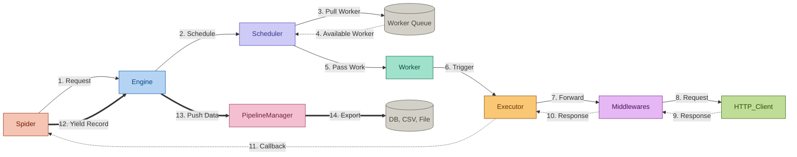

# GoScrapy Core Architecture

GoScrapy's data flow is designed for clarity and concurrent execution, utilizing a battle-tested architecture inspired by the Scrapy framework.

## Data Flow Diagram

## Component Breakdown

1.  **Spider**: Your custom code that defines initial requests and parses responses.
2.  **Engine**: The central orchestrator that coordinates data flow between all components.
3.  **Scheduler**: Manages the request queue and handles worker distribution.
4.  **Worker**: Lightweight concurrent execution units that pull work from the scheduler.
5.  **Executor**: Manages the execution context of a request, including middleware triggering.
6.  **Middlewares**: Pluggable components that process requests/responses (e.g., retries, cookies).
7.  **Pipeline Manager**: Handles the post-processing and export of yielded items.
