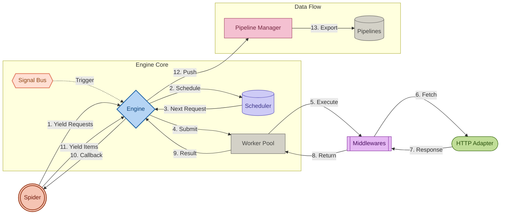

# GoScrapy Core Architecture

GoScrapy's data flow is designed for clarity and concurrent execution, utilizing a battle-tested architecture inspired by the Scrapy framework.

## Data Flow Diagram

## Component Breakdown

1.  **Spider**: Your custom logic defining requests and parsing. Automatically discovered via reflection.
2.  **Engine**: The central orchestrator utilizing a **Signal Bus** for event-driven coordination.
3.  **Scheduler**: Manages the priority queue of pending requests.
4.  **Worker Pool**: A dynamic pool of workers that execute requests concurrently.
5.  **HTTP Adapter**: The network layer that performs the actual data fetching (e.g., standard HTTP, TLS spoofing).
6.  **Middlewares**: Pluggable hooks for modifying requests/responses (retries, cookies, stats).
7.  **Pipeline Manager**: Processes and exports items yielded by the spider.

## Signal-Driven Lifecycle

Starting with v0.26.0, GoScrapy uses a signal-based architecture to decouple core components. Instead of direct method calls between deep layers, the framework emits signals that interested components can subscribe to.

### Key Lifecycle Events:

- **SpiderOpened**: Triggered when the engine starts. This automatically calls the `Open(ctx)` method on your spider if it exists.
- **SpiderIdle**: Triggered when the engine detects no active requests or pending items. This is used for graceful shutdown.
- **SpiderClosed**: Triggered when the engine has finished all work.
- **ItemScraped/Dropped**: Triggered by the Pipeline Manager to notify observers of item progress.

This design allows for powerful extensions like the **TUI Dashboard** to monitor the crawler without modifying the core scraping logic.

## Auto-Discovery

GoScrapy minimizes boilerplate by automatically discovering and connecting your spider's methods to the signal bus. If your spider struct implements any of the following methods, they will be connected automatically:

- `Open(context.Context)`
- `Close(context.Context)`
- `Idle(context.Context)`
- `Error(context.Context, error)`

The engine uses reflection to map these methods to the internal signal bus during `RegisterSpider`, allowing you to focus on scraping logic rather than framework wiring.
