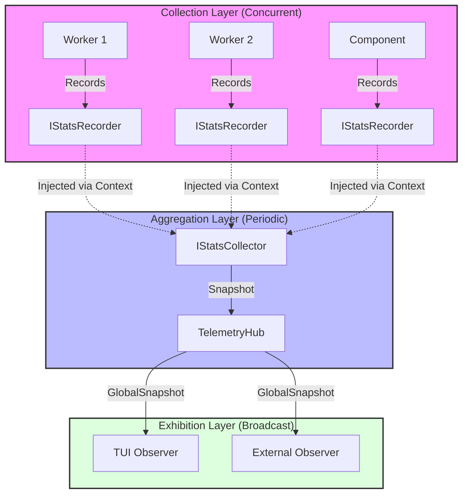
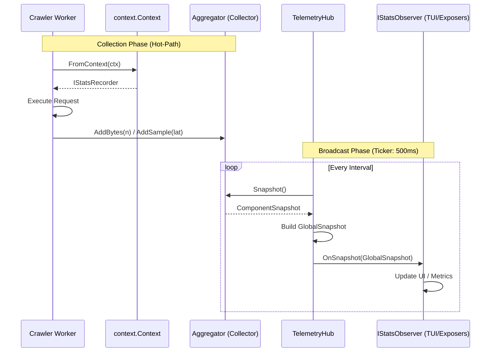

# GoScrapy Telemetry Architecture

GoScrapy's telemetry system uses a decoupled, three-layer architecture to enable high-performance metric collection without blocking the crawler's hot-path.

## Architecture Overview

## Telemetry Flow Sequence

The following sequence highlights the decoupling between the high-speed recording path (async) and the periodic broadcasting path (ticker-based).

## Component Roles

| Interface | Role | Lifecycle |
| :--- | :--- | :--- |
| **IStatsRecorder** | Captures individual events (bytes, duration). | Short-lived, per-request (via Context). |
| **IStatsCollector** | Aggregates recordings into a component-level state. | Long-lived, bound to Engine components. |
| **TelemetryHub** | Orchestrates periodic polling and broadcasting. | Singleton, bound to Engine lifecycle. |
| **IStatsObserver** | Consumes snapshots for visualization or export. | Pluggable (e.g., TUI, Prometheus). |
