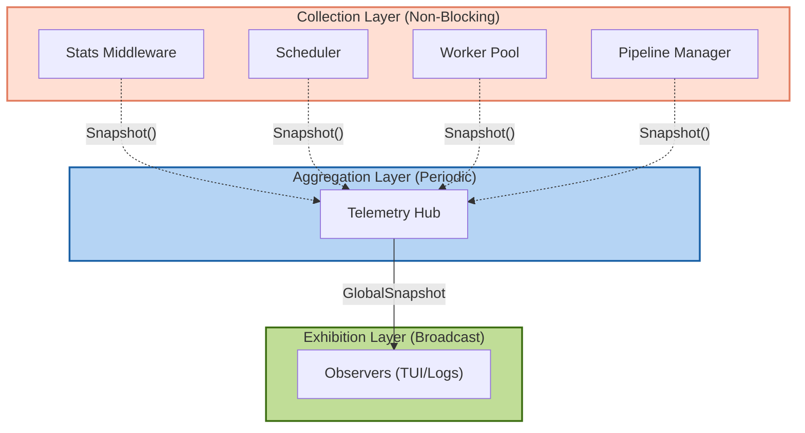
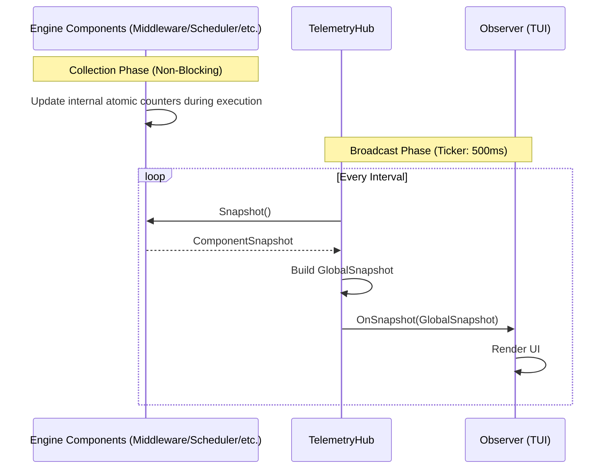

# GoScrapy Telemetry Architecture

GoScrapy's telemetry system uses a decoupled, three-layer architecture to enable high-performance metric collection without blocking the crawler's hot-path.

## Architecture Overview

## Telemetry Flow Sequence

The following sequence highlights the decoupling between the high-speed recording path (async) and the periodic broadcasting path (ticker-based).

## Component Roles

| Component | Role | Implementation |
| :--- | :--- | :--- |
| **Engine Components** | Maintain their own local metrics without a central bottleneck. | `sync/atomic` counters inside `Scheduler`, `WorkerPool`, `PipelineManager`, etc. |
| **Stats Middleware** | Specifically captures HTTP request/response metrics (latency, status codes). | Pluggable middleware using atomic variables. |
| **TelemetryHub** | Orchestrates periodic polling of all registered components. | Background loop with a Go `time.Ticker`. |
| **IStatsObserver** | Consumes aggregated snapshots for visualization or export. | TUI (bubbletea) dashboard or standard logging. |
